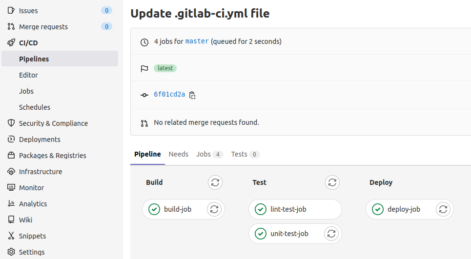
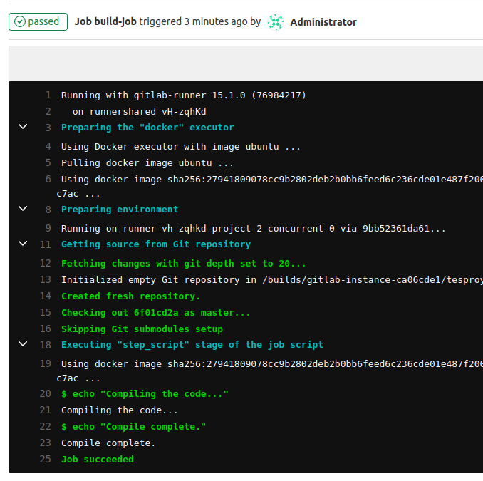

# Sitio Oficial:
* Link: https://registry.hub.docker.com/r/gitlab/gitlab-ce/

# Descripcion:
* Git lab community con runner y repositorios
* (Material de estudio)

# Configurar Network custom 
Configurar el siguiente network
```
    docker network create -d bridge my-custom-network

```

# Iniciar (GIT-LAB-CI)
1. Iniciar contenedores y revisar si estan corriendo
```
    docker-compose up -d 
```
```
    root# docker ps
    CONTAINER ID   IMAGE                         COMMAND                  CREATED         STATUS                            PORTS   NAMES
    abbcb0ad083e   gitlab/gitlab-runner:latest   "/usr/bin/dumb-init …"   4 seconds ago   Up 3 seconds                              gitlab-runner
    58781119d54d   gitlab/gitlab-ce:latest       "/assets/wrapper"        5 seconds ago   Up 3 seconds (health: starting)           gitlab-web

```
3. Ingresar el siguiente comando en el teminal para obtener pasword generada
```
    docker exec -it <ID-CONTAINER> grep 'Password:' /etc/gitlab/initial_root_password
    docker exec -it gitlab-web grep 'Password:' /etc/gitlab/initial_root_password
```
2. Ingresar a url
```
    http://localhost/users/sign_in
    user: root
    pass: <password generada>
```
# Registrar (GIT-RUNNER)
1. Una vez que se encuentren corriendo los 2 contenedores el runner y el git tendremos el siguiente error que es normal en el contenedor runner
    * Y el error se debe a que aún no hemos configurado ni registrado nuestro corredor en ningún servidor de Gitlab.
```
    // error esperable
    gitlab-runner  | ERROR: Failed to load config stat /etc/gitlab-runner/config.toml: no such file or directory  builds=0
```
2. Ingresamos al runner por consola interactiva al contenedor
```
    docker exec -it gitlab-runner bash
```
3. Dentro del contenedor Registramos nuestro corredor 
    * Utilizaremos la URL: `http://gitlab-web/`
    * Token: (Se obtiene desde GitLab)
        * Menu/Admin/Overview/Runners
        * Hacer click en boton azul 'Register an instance runner' y copiar token
```
    //registrar elegir solo una
    [op1] gitlab-runner register
    [op2] gitlab-runner register --docker-network-mode 'host'

    //Ejemplo de registro
    Enter the GitLab instance URL (for example, https://gitlab.com/):
        http://gitlab-web/  
    Enter the registration token:
        8JLD4WogjkDoonPshxDC
    Enter a description for the runner:
        [60bf953184e1]: runnershared
    Enter tags for the runner (comma-separated):
        runner-shared
    Enter optional maintenance note for the runner:

    Registering runner... succeeded                     runner=8JLD4Wog
    Enter an executor: shell, ssh, docker+machine, docker-ssh+machine, parallels, docker, docker-ssh, virtualbox, kubernetes, custom:
        docker
    Enter the default Docker image (for example, ruby:2.7):
        ubuntu
    Runner registered successfully. Feel free to start it, but if it's running already the config should be automatically reloaded! 

```

* Tras ejecutar [runner register:op1]
    * configurar archivo `config.toml` y agregar la siguiente configuracion:
    ...
    ```
        [runners.docker]
        ...
        network_mode = "host"

    ```

* Actualizar(F5) y revisar `Menu/Admin/Overview/Runners`, debe aparecer el runner en verde

# Configurar runner shared para repositorio
1. En `Menu/Admin/Overview/Runners` seleccionar a editar runner creado 
    * Marcamos o activamos la opcion `Run untagged jobs` y guardamos cambios

2. Ir a repositorio y revisamos
    * `<repo_selecionado>/setting/CICD/RUNNERS`
        * Activar `Enable shared runners for this project`

3. Creacion de `.gitlab-ci.yml` y ejecucion de Pipelines
    * Ir `<repo_selecionado>/CICD/Editor`
        * Seleccionamos `Configure Pipelines`
        * Agregamos nuestro Pipelines y hacemos commit al repositorio.
        * (Comenzara automaticamente la ejecucion de nuestro primer Pipelines)

# Configurar runner para repositorio
1. Ir a repositorio y revisamos
    * `<repo_selecionado>/setting/CICD/RUNNERS`
        * Desactivamos `Enable shared runners for this project`
2. Revisar seccion `Specific runners`
    * Registraremos otro runner con el token que nos genera para ese repositorio
    * Tras agregarlo actualizamos la pagina (F5) y nos aparecera con un icono de 'alerta'
    * Tras voler a actualizar la pagina (F5) y nos aparecera en color verda
3. Habilitar que el runner pueda ejecutar Pipelines
    * Editamos el runner creado 
        * En `Menu/Admin/Overview/Runners` seleccionar a editar runner creado 
            * Marcamos o activamos la opcion `Run untagged jobs` y guardamos cambios
4. Creacion de `.gitlab-ci.yml` y ejecucion de Pipelines
    * Ir `<repo_selecionado>/CICD/Editor`
        * Seleccionamos `Configure Pipelines`
        * Agregamos nuestro Pipelines y hacemos commit al repositorio.
        * (Comenzara automaticamente la ejecucion de nuestro primer Pipelines)

# Revisar ejecucion Pipelines
4. Revisar ejecucion Pipelines
    * Ir `<repo_selecionado>/Pipelines`
        * Pipelines 

            

        * Ejecucion

            

# Notas

* https://bwgjoseph.com/how-to-setup-and-configure-your-own-gitlab-runner
* https://stackoverflow.com/questions/64675170/gitlab-ci-how-to-create-the-shared-runner-in-gitlab-which-does-not-depend-on
* https://stackoverflow.com/questions/33430487/how-to-use-gitlab-ci-to-build-a-java-maven-project

* Problem runner: Couldn't resolve host
    * https://gitlab.com/gitlab-org/gitlab-runner/-/issues/305
    * https://stackoverflow.com/questions/50325932/gitlab-runner-docker-could-not-resolve-host

* Problem runner Operation timed out
    * https://askto.pro/question/how-to-fix-failed-to-connect-to-gitlab-web-port-80-in-gitlab

* custom-network
    * https://twig2let.github.io/docker/docker_networkBetweenMultipleDockerComposeServices.html
    * https://stackoverflow.com/questions/52757357/create-custom-network-for-docker-compose-via-command-line
    * config.toml: https://stackoverflow.com/questions/38737862/gitlab-ci-add-net-host-option-to-docker

\